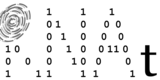
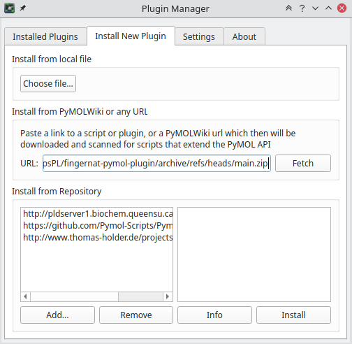
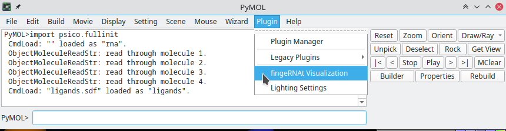
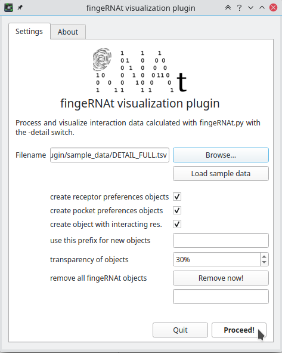
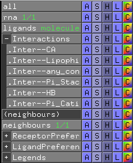
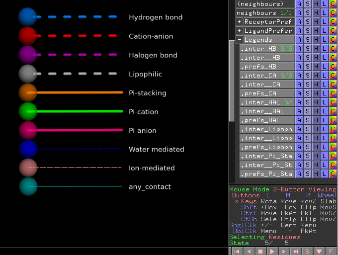
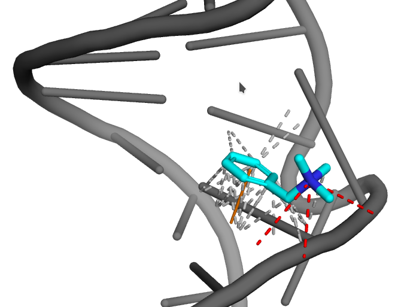
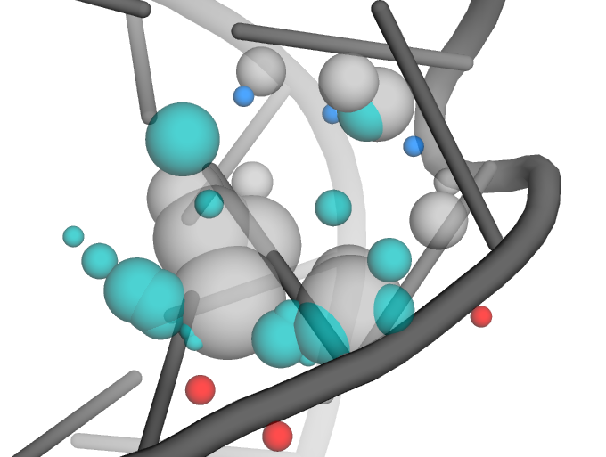
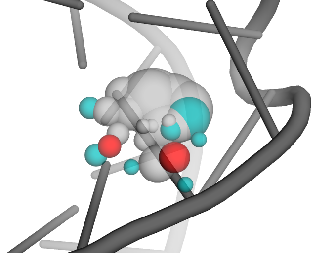
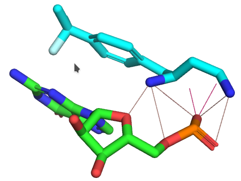

fingernat-pymol-plugin
============

<!-- TOC START min:1 max:6 link:true asterisk:false update:true -->
- [About](#about)
- [Installation](#installation)
  - [Prerequisities](#prerequisities)
  - [Plugin installation in pymol](#plugin-installation-in-pymol)
- [Compatibility and tests](#compatibility-and-tests)
- [Usage](#usage)
- [Screenshots](#screenshots)
- [Contributors](#contributors)
<!-- TOC END -->


# About



This PyMOL plugin visualizes interactions detected by the [fingeRNAt progam](https://github.com/n-szulc/fingeRNAt/). This means that you need to run it first and generate data to be visualized in this plugin. But don't worry, it's quite simple :)

This plugin works best with PyMOL >= 2.2.3 and Python 3.

[](https://github.com/filipsPL/fingernat-pymol-plugin/actions/workflows/action-links.yml)

# Installation

## Prerequisities

The plugin works under the python 3 and makes use of the pandas module. To install it:

```bash
# using pip
python3 -m pip install pandas

# or conda
conda install pandas

# or in debian/ubuntu using apt:
apt install python3-pandas

# or install the full conda environment of pymol and pandas, ready to install this plugin
conda create -y --name pymol-pandas -c conda-forge  python">=3.5" pandas pymol-open-source
```

## Plugin installation in pymol

1. In PyMOL window go to top menu - Plugin manager - Install new plugin
1. In the URL paste the link to the latest code archive: `https://github.com/filipsPL/fingernat-pymol-plugin/archive/refs/heads/main.zip`
   - ... or alternatively, copy and paste the link to the zip archive in the [latest release](https://github.com/filipsPL/fingernat-pymol-plugin/releases/latest) page.



click fetch, confirm the installation and the path.

3. The fingeRNAt plugin is available in the Plugin menu:




# Compatibility and tests

This pymol plugin was tested in the following setups:

| PyMOL version | Linux | MacOS | Windows |
| ------------- |:-----:| ----- | ------- |
| 2.2.3         |  ✅   |       |         |
| 2.3.2         |  ✅   |       |         |
| 2.4.0         |  ✅   |       |         |
| 2.5.0         |  ✅   |       |         |
| 2.6.0a        |  ✅   |       |         |


# Usage

1. Load into PyMOL nucleic acid and ligand structures you had used to detect interactions with the fingeRNAt.

2. Open the fingeRNAt plugin, click Browse and point to the DETAIL_... tsv file which was generated by fingeRNAt.

3. Click `Proceed!`



4. A bunch of new groups and objects are created:



- Interactions: objects holding detected interactions. The exact number depends of the detected inteactions types.
- Receptor preferences: objects showing preferences of the receptor for forming/accomodating the given type of interaction.
- Ligand preferences: objects showing preferences of the ligand binding pocket for forming/accomodating the given type of interaction.
- Neighbours: fragment of the receptor containing residues which form interactions with ligand

Each group and object can be hidden/shown separately.

5. Each ligand's model (state) contains interactions detected for this particular model. The last model (state) contains the visual legend of the detected interactions:




Additionally, the color codes are printed in the console:

```
---------- Colors legend: -----------
  Hydrogen bond (HB) is presented in marine
  Cation-anion (CA) is presented in red
  Halogen bond (HAL) is presented in purple
  Lipophilic (Lipophilic) is presented in silver
  Pi-stacking (Pi_Stacking) is presented in orange
  Pi-cation (Pi_Cation) is presented in green
  Pi-anion (Pi_Anion) is presented in hotpink
  Water-mediated (Water-mediated) is presented in blue
  Ion-mediated (Ion-mediated) is presented in salmon
  any_contact (any_contact) is presented in teal
```

# Screenshots


| pymol                            | description                                                                    |
| -------------------------------- | ------------------------------------------------------------------------------ |
|  | Overview of the formed interactions                                            |
|  | Receptor preferences                                                           |
|  | Ligand preferences in the ligand binding site                                 |
|  | Preferred positions of Pi-involving interactions and cation anion-interactions |
|  | As above, but for the receptor                                                 |
|  | User defined interactions; some bonds are heading to implicit hydrogens        |


# Contributors

| :octocat:       | github                                   | contact                                                                  |
| --------------- | ---------------------------------------- | ------------------------------------------------------------------------ |
| Filip Stefaniak | [@filipsPL](https://github.com/filipsPL) |  |
| Natalia Szulc   | [@n-szulc](https://github.com/n-szulc)   |      |
