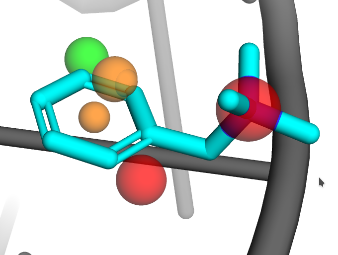
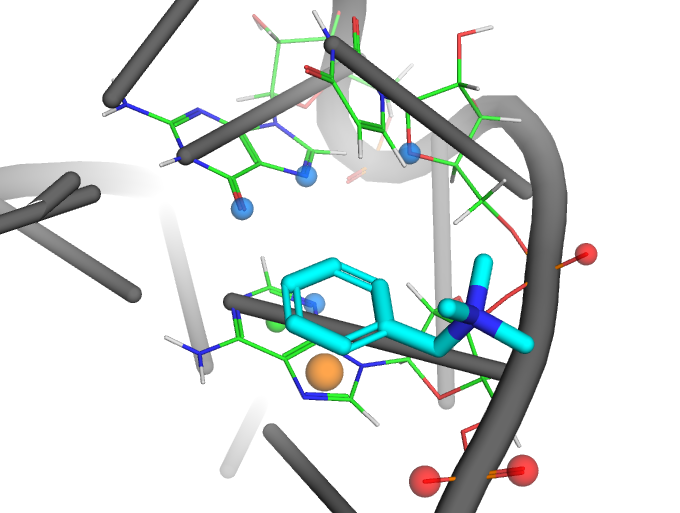

fingernat-pymol-plugin
============

<!-- TOC START min:1 max:6 link:true asterisk:false update:true -->
- [About](#about)
- [Installation](#installation)
- [Usage](#usage)
- [Screenshots](#screenshots)
- [Contributors](#contributors)
<!-- TOC END -->


# About


This PyMOL plugin visualizes interactions detected by the [fingeRNAt progam](https://github.com/n-szulc/fingeRNAt/). Works with PyMOL 2.x and Python 3.

<!-- markdown-link-check-disable-next-line -->
[](https://github.com/filipsPL/fingernat-pymol-plugin/actions/workflows/action-links.yml)

# Installation

<!-- markdown-link-check-disable-next-line -->
In PyMOL window go to top menu - Plugin manager - Install new plugin - paste *https://github.com/filipsPL/fingernat-pymol-plugin* in the URL field, click `Fetch`:


The fingeRNAt plugin will be available from the Plugin menu:


# Usage

1. Load into PyMOL nucleic acid and ligand structures you had used to detect interactions with the fingeRNAt.

2. Open the fingeRNAt plugin, click Browse and point to the DETAIL_... tsv file which was generated by fingeRNAt.

3. Click `Proceed!`


4. A bunch of new groups and objects are created:


- Interactions: objects holding detected interactions. The exact number depends of the detected inteactions types.
- Receptor preferences: objects showing preferences of the receptor for forming/accomodating the given type of interaction.
- Ligand preferences: objects showing preferences of the ligand binding pocket for forming/accomodating the given type of interaction.
- Neighbours: fragment of the receptor containing residues which form interactions with ligand

Each group and object can be hidden/shown separately.

5. Each ligand's model (state) contains interactions detected for this particular model. The last model (state) contains the visual legend of the detected interactions:


Additionally, the color codes are printed in the console:

```
---------- Colors legend: -----------
  Hydrogen bond (HB) is presented in marine
  Cation-anion (CA) is presented in red
  Halogen bond (HAL) is presented in purple
  Lipophilic (Lipophilic) is presented in silver
  Pi-stacking (Pi_Stacking) is presented in orange
  Pi-cation (Pi_Cation) is presented in green
  Pi-anion (Pi_Anion) is presented in hotpink
  Water-mediated (Water-mediated) is presented in blue
  Ion-mediated (Ion-mediated) is presented in salmon
  any_contact (any_contact) is presented in teal
```

# Screenshots


| pymol                            | description                                                                    |
| -------------------------------- | ------------------------------------------------------------------------------ |
|  | Overview of the formed interactions                                            |
|  | Receptor preferences                                                           |
|  | Ligand preferences in the ligand binding site                                 |
|  | Preferred positions of Pi-involving interactions and cation anion-interactions |
|  | As above, but for the receptor                                                 |


# Contributors

| :octocat:       | github    | contact                                                                  |
| --------------- | --------- | ------------------------------------------------------------------------ |
| Filip Stefaniak | [@filipsPL](https://github.com/filipsPL) |  |
| Natalia Szulc   | [@n-szulc](https://github.com/n-szulc)  |      |
